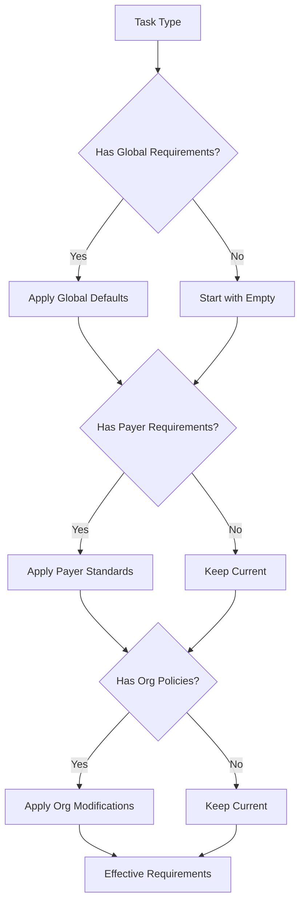

# Hierarchical Requirements System Guide

_A comprehensive guide to the RCM platform's hierarchical field requirements system_

---

## Table of Contents
1. [Introduction](#introduction)
2. [Architecture Overview](#architecture-overview)
3. [Database Schema](#database-schema)
4. [Using the RequirementResolver API](#using-the-requirementresolver-api)
5. [Migration Guide](#migration-guide)
6. [Common Scenarios](#common-scenarios)
7. [Best Practices](#best-practices)
8. [Troubleshooting](#troubleshooting)

---

## Introduction

### The Problem

In healthcare RCM (Revenue Cycle Management), different insurance payers require specific fields for various operations like eligibility checks, claim submissions, and prior authorizations. Previously, the RCM platform stored these requirements at the organization-portal level, leading to:

- **Massive Duplication**: The same Anthem eligibility requirements copied across hundreds of organizations
- **Maintenance Nightmare**: Updating Anthem's requirements meant changing hundreds of database records
- **Inconsistency Risk**: Some organizations might have outdated requirement copies
- **No Single Source of Truth**: Difficult to know what the "official" payer requirements are

### The Solution

The hierarchical requirements system introduces a three-tier architecture that eliminates duplication while maintaining flexibility:

```
┌─────────────────────────┐
│   Global Defaults       │  ← Base requirements for any task type
└───────────┬─────────────┘
            │
┌───────────▼─────────────┐
│  Payer Requirements     │  ← Payer-specific standards (e.g., Anthem's rules)
└───────────┬─────────────┘
            │
┌───────────▼─────────────┐
│ Organization Policies   │  ← Org-specific overrides/additions
└───────────┬─────────────┘
            │
┌───────────▼─────────────┐
│ Effective Requirements  │  ← Computed result for actual use
└─────────────────────────┘
```

### Key Benefits

- **DRY Principle**: Define payer requirements once, use everywhere
- **Flexibility**: Organizations can still customize for their needs
- **Maintainability**: Update payer requirements in one place
- **Auditability**: Complete change history with compliance tracking
- **Performance**: Materialized view ensures fast lookups
- **Versioning**: Support for requirement evolution over time

---

## Architecture Overview

### Core Components

1. **Payer Requirements** (`payer_requirement` table)
   - Stores base requirements from insurance companies
   - Versioned with effective dates
   - Includes compliance references (e.g., "HIPAA 837P v5010")

2. **Organization Policies** (`org_requirement_policy` table)
   - Organization-specific modifications
   - Three policy types: ADD, REMOVE, OVERRIDE
   - Can target specific portal types or apply broadly

3. **Requirement Changelog** (`requirement_changelog` table)
   - Audit trail of all changes
   - Tracks who, what, when for compliance
   - Stores previous and new values

4. **Effective Requirements** (`effective_requirements` view)
   - Materialized view for performance
   - Pre-computed merge of payer + org requirements
   - Automatically refreshed on changes

### Inheritance Flow



---

## Database Schema

### payer_requirement

Stores payer-level requirements that apply to all organizations using that payer's portal.

| Column | Type | Purpose |
|--------|------|---------|
| requirement_id | UUID PK | Unique identifier |
| portal_type_id | INT FK | References portal_type |
| task_type_id | UUID FK | References task_type |
| version | INT | Version number (1, 2, 3...) |
| required_fields | JSONB | Array of required field names |
| optional_fields | JSONB | Array of optional field names |
| field_rules | JSONB | Validation rules per field |
| compliance_ref | TEXT | Compliance standard reference |
| effective_date | DATE | When this version takes effect |
| created_at | TIMESTAMPTZ | Creation timestamp |
| created_by | UUID FK | User who created |

**Example Row:**
```json
{
  "requirement_id": "a1b2c3d4-...",
  "portal_type_id": 2,  // Anthem
  "task_type_id": "e5f6g7h8-...",  // Eligibility Check
  "version": 1,
  "required_fields": ["member_id", "dob", "ssn"],
  "optional_fields": ["group_number", "phone"],
  "field_rules": {
    "member_id": {
      "pattern": "^W\\d{9}$",
      "description": "Anthem member ID format"
    },
    "dob": {
      "pattern": "^\\d{4}-\\d{2}-\\d{2}$",
      "description": "ISO date format"
    }
  },
  "compliance_ref": "Anthem Provider Manual 2025 v1.2",
  "effective_date": "2025-01-01"
}
```

### org_requirement_policy

Defines how organizations modify payer requirements.

| Column | Type | Purpose |
|--------|------|---------|
| policy_id | UUID PK | Unique identifier |
| org_id | UUID FK | Organization applying policy |
| task_type_id | UUID FK | Task type affected |
| portal_type_id | INT FK | Optional portal type scope |
| policy_type | TEXT | 'add', 'remove', or 'override' |
| field_changes | JSONB | Changes to apply |
| reason | TEXT | Business justification |
| version | INT | Policy version |
| active | BOOLEAN | Is policy active? |
| created_by | UUID FK | Creator |
| approved_by | UUID FK | Approver |
| approved_at | TIMESTAMPTZ | Approval timestamp |

**Policy Types Explained:**

1. **ADD**: Adds fields to payer requirements
   ```json
   {
     "policy_type": "add",
     "field_changes": {
       "required_fields": ["internal_case_id", "department_code"]
     }
   }
   ```

2. **REMOVE**: Removes fields from requirements
   ```json
   {
     "policy_type": "remove",
     "field_changes": {
       "optional_fields": ["phone"]
     }
   }
   ```

3. **OVERRIDE**: Complete replacement
   ```json
   {
     "policy_type": "override",
     "field_changes": {
       "required_fields": ["member_id", "auth_code"],
       "optional_fields": []
     }
   }
   ```

### effective_requirements (Materialized View)

Pre-computed requirements for fast runtime access.

| Column | Type | Purpose |
|--------|------|---------|
| portal_id | INT | Integration endpoint |
| org_id | UUID | Organization |
| portal_type_id | INT | Portal type |
| task_type_id | UUID | Task type |
| required_fields | JSONB | Merged required fields |
| optional_fields | JSONB | Merged optional fields |
| field_rules | JSONB | Merged validation rules |
| compliance_ref | TEXT | From payer requirement |
| last_updated | TIMESTAMPTZ | View refresh time |

---

## Using the RequirementResolver API

### Basic Usage

```python
from requirement_resolver import RequirementResolver
from database import get_async_session

async def get_portal_requirements():
    async with get_async_session() as session:
        resolver = RequirementResolver(session)
        
        # Get requirements for a specific portal and task
        requirements = await resolver.get_requirements(
            portal_id=17,  # North Valley Hospital's Anthem portal
            task_type_id="c101-e3f4-..."  # Eligibility check
        )
        
        print(f"Required fields: {requirements.required_fields}")
        print(f"Optional fields: {requirements.optional_fields}")
        print(f"Compliance ref: {requirements.compliance_ref}")
```

### Field Validation

```python
# Validate submitted data against requirements
async def validate_submission(portal_id, task_type_id, data):
    async with get_async_session() as session:
        resolver = RequirementResolver(session)
        
        result = await resolver.validate_fields(
            portal_id=portal_id,
            task_type_id=task_type_id,
            submitted_fields=data
        )
        
        if not result.is_valid:
            print(f"Missing required fields: {result.missing_required}")
            print(f"Validation errors: {result.validation_errors}")
            return False
        
        return True

# Example usage
data = {
    "member_id": "W123456789",
    "dob": "1990-01-15",
    "ssn": "123-45-6789",
    "internal_case_id": "CASE-2025-001"  # Org-specific field
}

is_valid = await validate_submission(17, task_type_id, data)
```

### Validation Rules

The system supports various field validation rules:

```python
field_rules = {
    "member_id": {
        "pattern": r"^W\d{9}$",  # Regex pattern
        "min_length": 10,
        "max_length": 10
    },
    "auth_status": {
        "enum": ["pending", "approved", "denied"]  # Allowed values
    },
    "service_date": {
        "pattern": r"^\d{4}-\d{2}-\d{2}$",
        "min_length": 10
    }
}
```

### Getting All Requirements for an Organization

```python
# Get requirements across all portals for an org
all_requirements = await resolver.get_all_requirements_for_org(
    org_id="7b1d-1111-...",
    task_type_id="c101-e3f4-..."  # Optional filter
)

for req in all_requirements:
    print(f"Portal {req.portal_id}: {len(req.required_fields)} required fields")
```

---

## Migration Guide

### Step 1: Prepare for Migration

1. **Backup your database**
   ```bash
   pg_dump -h localhost -U user -d rcm_db > backup_before_migration.sql
   ```

2. **Review existing requirements**
   ```bash
   python migrate_requirements_data.py --dry-run
   ```

### Step 2: Run Schema Migration

```bash
# Apply the new schema
alembic upgrade head

# This creates:
# - payer_requirement table
# - org_requirement_policy table  
# - requirement_changelog table
# - effective_requirements materialized view
# - Necessary triggers and functions
```

### Step 3: Migrate Existing Data

```bash
# Dry run to see what will happen
python migrate_requirements_data.py

# Execute the migration
python migrate_requirements_data.py --execute
```

The migration script will:
1. Analyze existing field_requirement records
2. Identify common patterns as payer requirements
3. Create org policies for deviations
4. Preserve all existing behavior

### Step 4: Update Application Code

Replace direct field_requirement queries with RequirementResolver:

**Before:**
```python
# Old way - direct query
requirements = await session.execute(
    select(FieldRequirement).where(
        FieldRequirement.portal_id == portal_id,
        FieldRequirement.task_type_id == task_type_id
    )
)
```

**After:**
```python
# New way - using resolver
resolver = RequirementResolver(session)
requirements = await resolver.get_requirements(portal_id, task_type_id)
```

### Step 5: Verify Migration

```python
# Verification script
async def verify_migration():
    async with get_async_session() as session:
        # Check materialized view
        count = await session.scalar(
            select(func.count()).select_from(
                text("effective_requirements")
            )
        )
        print(f"Effective requirements: {count} rows")
        
        # Test a few known cases
        resolver = RequirementResolver(session)
        req = await resolver.get_requirements(portal_id, task_type_id)
        assert "member_id" in req.required_fields
```

---

## Common Scenarios

### Scenario 1: Payer Updates Requirements

Anthem adds a new required field for eligibility checks:

```sql
-- Create new version of Anthem requirements
INSERT INTO payer_requirement (
    portal_type_id,
    task_type_id,
    version,
    required_fields,
    compliance_ref,
    effective_date
)
SELECT 
    portal_type_id,
    task_type_id,
    version + 1,
    required_fields || '["diagnosis_code"]'::jsonb,
    'Anthem Provider Manual 2025 v2.0',
    '2025-02-01'
FROM payer_requirement
WHERE portal_type_id = 2  -- Anthem
  AND task_type_id = 'c101-...'
  AND version = (
    SELECT MAX(version) 
    FROM payer_requirement 
    WHERE portal_type_id = 2 AND task_type_id = 'c101-...'
  );
```

All organizations using Anthem automatically get the new requirement on the effective date!

### Scenario 2: Hospital Adds Internal Tracking

North Valley Hospital needs internal case numbers:

```python
async def add_hospital_tracking():
    async with get_async_session() as session:
        policy = OrgRequirementPolicy(
            org_id="7b1d-1111-...",
            task_type_id="c101-...",  # Eligibility check
            policy_type="add",
            field_changes={
                "required_fields": ["internal_case_id"],
                "field_rules": {
                    "internal_case_id": {
                        "pattern": r"^CASE-\d{4}-\d{3}$"
                    }
                }
            },
            reason="Hospital policy: all cases need tracking number",
            active=True
        )
        session.add(policy)
        await session.commit()
```

### Scenario 3: Remove Unnecessary Field

Organization finds they don't need a payer's optional field:

```python
policy = OrgRequirementPolicy(
    org_id=org_id,
    task_type_id=task_type_id,
    portal_type_id=portal_type_id,  # Specific to this portal
    policy_type="remove",
    field_changes={
        "optional_fields": ["secondary_insurance_info"]
    },
    reason="Not used in our workflow",
    active=True
)
```

### Scenario 4: Compliance Audit

Find all requirement changes in the last 30 days:

```sql
SELECT 
    rc.changed_at,
    rc.source_table,
    rc.change_type,
    u.username as changed_by,
    rc.new_value->>'compliance_ref' as compliance_ref
FROM requirement_changelog rc
LEFT JOIN app_user u ON rc.changed_by = u.user_id
WHERE rc.changed_at > CURRENT_DATE - INTERVAL '30 days'
ORDER BY rc.changed_at DESC;
```

---

## Best Practices

### 1. Use Semantic Versioning

When updating payer requirements, increment versions meaningfully:
- Major changes (new required fields): version + 1
- Minor changes (validation rules): consider batching
- Always include compliance references

### 2. Document Policy Reasons

Always provide clear reasons for org policies:

```python
# Good
reason = "Hospital billing dept requires internal tracking per policy BD-2025-01"

# Bad  
reason = "Added field"
```

### 3. Plan Effective Dates

Give organizations time to adapt:

```python
# Announce changes in advance
effective_date = date.today() + timedelta(days=30)
```

### 4. Monitor Materialized View Performance

```sql
-- Check view refresh time
SELECT 
    schemaname,
    matviewname,
    last_refresh
FROM pg_stat_user_tables
WHERE schemaname = 'public' 
  AND tablename = 'effective_requirements';
```

### 5. Use Transactions for Complex Updates

```python
async with session.begin():
    # Create new payer requirement version
    new_req = PayerRequirement(...)
    session.add(new_req)
    
    # Deactivate conflicting org policies if needed
    await session.execute(
        update(OrgRequirementPolicy)
        .where(...)
        .values(active=False)
    )
    
    # Commit atomically
```

---

## Troubleshooting

### Issue: Requirements Not Updating

**Symptom**: Changes to payer_requirement don't appear in get_requirements()

**Solution**: 
1. Check if materialized view needs refresh:
   ```sql
   REFRESH MATERIALIZED VIEW effective_requirements;
   ```

2. Verify effective_date:
   ```sql
   SELECT * FROM payer_requirement 
   WHERE effective_date > CURRENT_DATE;
   ```

### Issue: Validation Unexpected Behavior

**Symptom**: Fields marked required but validation passes without them

**Debug Steps**:
```python
# Check what requirements are actually loaded
requirements = await resolver.get_requirements(portal_id, task_type_id)
print(f"Source: {requirements.source}")  # 'effective_requirements' or 'computed'
print(f"Required: {requirements.required_fields}")

# Check for conflicting policies
policies = await session.execute(
    select(OrgRequirementPolicy).where(
        OrgRequirementPolicy.org_id == org_id,
        OrgRequirementPolicy.task_type_id == task_type_id,
        OrgRequirementPolicy.active == True
    )
)
for policy in policies:
    print(f"Policy {policy.policy_id}: {policy.policy_type}")
```

### Issue: Performance Degradation

**Symptom**: Requirement lookups becoming slow

**Solutions**:
1. Ensure materialized view indexes exist:
   ```sql
   \d effective_requirements
   ```

2. Analyze query patterns:
   ```sql
   EXPLAIN ANALYZE
   SELECT * FROM effective_requirements
   WHERE portal_id = ? AND task_type_id = ?;
   ```

3. Consider partitioning for very large datasets

### Issue: Circular Dependencies

**Symptom**: Org policies conflicting or creating loops

**Prevention**:
- Use policy versioning
- Implement policy precedence rules
- Regular audit of active policies:

```sql
SELECT 
    o.name as org_name,
    pt.name as portal_type,
    tt.display_name as task_type,
    COUNT(*) as active_policies
FROM org_requirement_policy orp
JOIN organization o ON orp.org_id = o.org_id
LEFT JOIN portal_type pt ON orp.portal_type_id = pt.portal_type_id
JOIN task_type tt ON orp.task_type_id = tt.task_type_id
WHERE orp.active = TRUE
GROUP BY o.name, pt.name, tt.display_name
HAVING COUNT(*) > 1;
```

---

## Appendix: Complete Example

Here's a full example showing the system in action:

```python
# 1. Payer defines base requirements
anthem_req = PayerRequirement(
    portal_type_id=2,  # Anthem
    task_type_id=eligibility_task_id,
    required_fields=["member_id", "dob", "ssn"],
    optional_fields=["group_number"],
    field_rules={
        "member_id": {"pattern": r"^W\d{9}$"},
        "ssn": {"pattern": r"^\d{3}-\d{2}-\d{4}$"}
    },
    compliance_ref="Anthem Guide 2025",
    effective_date=date(2025, 1, 1)
)

# 2. Hospital adds internal requirements
hospital_policy = OrgRequirementPolicy(
    org_id=hospital_org_id,
    task_type_id=eligibility_task_id,
    portal_type_id=2,  # Specific to Anthem
    policy_type="add",
    field_changes={
        "required_fields": ["department", "provider_npi"],
        "field_rules": {
            "provider_npi": {"pattern": r"^\d{10}$"}
        }
    },
    reason="Hospital requires provider tracking"
)

# 3. Result: Merged requirements
# Required: ["member_id", "dob", "ssn", "department", "provider_npi"]
# Optional: ["group_number"]
# Rules: Patterns for member_id, ssn, and provider_npi

# 4. Validation in action
data = {
    "member_id": "W123456789",
    "dob": "1990-01-15", 
    "ssn": "123-45-6789",
    "department": "Cardiology",
    "provider_npi": "1234567890"
}

result = await resolver.validate_fields(
    portal_id=hospital_anthem_portal_id,
    task_type_id=eligibility_task_id,
    submitted_fields=data
)

assert result.is_valid  # True - all requirements met!
```

---

This hierarchical requirements system provides a robust, scalable solution for managing field requirements across a complex healthcare platform while maintaining flexibility and auditability.